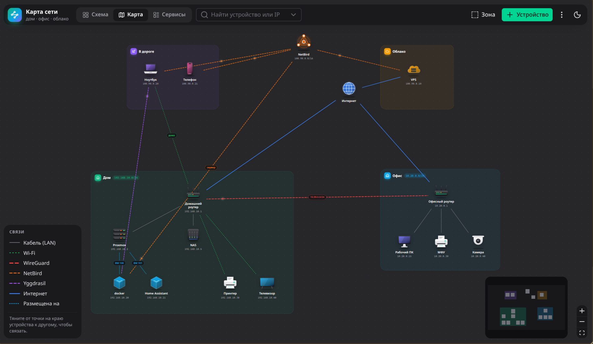

# Карта сети

[English](README.md) · **Русский**

Интерактивная карта домашней, офисной и облачной сети: устройства, зоны, связи
(LAN, Wi-Fi, WireGuard, NetBird, Yggdrasil, AmneziaWG) и живой пинг.

Nuxt 4 · Nuxt UI 4 · Vue Flow · SQLite (`node:sqlite` из Node 24, без нативных модулей).



## Два вида

- **Карта.** Устройства нарисованы картинками, их можно двигать. Зону двигают за
  заголовок, и устройства внутри неё едут вместе с ней; размер зоны меняется за
  углы, когда она выбрана. Если бросить устройство в другую зону, оно переходит в
  неё. Чтобы связать два устройства, тяните от точки на краю одного к другому.
- **Схема.** Автоматическая раскладка по колонкам-зонам, компактные карточки.
  Кабельные связи внутри зоны бледные и проявляются, когда выбрано устройство.

Нажатие на устройство, связь или заголовок зоны открывает панель справа: все адреса
(с копированием), сервисы со ссылками, связи, заметки, редактирование.

Пингует сервер карты, а не браузер. У каждого адреса устройства свой выбор: не
пинговать или пинговать раз в 10 с … 15 мин. По умолчанию локальный, NetBird и
публичный IPv4 — раз в 20 с, Yggdrasil — раз в 2 мин (и ответа ждём дольше).
Поменять можно в форме устройства или прямо в панели, нажав на отметку у адреса.
Индикатор устройства: зелёный — отвечают все отмеченные адреса, жёлтый — часть,
красный — ни один, серый — ещё проверяется. Под устройством метка «YGG», если
пингуется его адрес Yggdrasil.

Туннельные связи анимированы, и на большой карте это заметно грузит процессор.
Меню «⋮» → «Анимация» останавливает всё движение, пунктир связей остаётся. Если в
системе включено «уменьшить движение», анимация по умолчанию выключена.

## Сервисы

У сервиса три адреса: по IP, по локальному домену (имя с настоящим сертификатом,
которое резолвится только внутри сети) и из интернета. Сервисы хранятся в карточках
устройств, а вкладка «Сервисы» собирает их со всех машин, по зонам, с поиском;
там же их можно добавлять, править и переносить на другую машину.

## Запуск

```bash
docker compose up -d --build
```

Откроется на `http://<хост>:3080`. База — `./data/network.db`. При первом запуске
в ней появляется выдуманная демо-сеть из `server/demo-network.json`, чтобы было
видно, как всё выглядит. Её адреса не пингуются — они ненастоящие. Демо можно
править или сразу заменить своей картой (см. «Резервная копия»).

Обновление: `git pull && docker compose up -d --build`. База лежит в `./data` вне
образа и при обновлении не меняется.

Контейнер работает в сети хоста (`network_mode: host`): пинг уходит с самого хоста
и видит всё, что видит он, — локальную сеть, офис через туннель, NetBird и
Yggdrasil. Порт меняется переменной `PORT`.

## Резервная копия

Меню «⋮» → «Скачать JSON» сохраняет всю карту одним файлом, «Загрузить JSON…»
заменяет ею текущую. Так же через API:

```bash
curl -o network-map.json http://<хост>:3080/api/export
curl -X POST -H 'Content-Type: application/json' --data @network-map.json http://<хост>:3080/api/import
```

Восстановление на новом месте: `git clone`, `docker compose up -d --build`,
загрузить файл. Импорт заменяет карту целиком, номера устройств и связи
сохраняются как были.

## API для чтения

Чтобы другая программа или ИИ поняли сеть, дайте им один адрес:

- `GET /api/map.md` — вся карта текстом Markdown: как читать, зоны, устройства с
  адресами, состоянием пинга и сервисами, все связи. Для ИИ — этот.
- `GET /api/map` — то же в JSON: имена вместо номеров, словарь кодов (`legend`),
  пояснения к полям (`about`), без координат и цветов.

Только чтение; менять карту через них нельзя.

## Разработка

```bash
npm install
npm run dev
```
